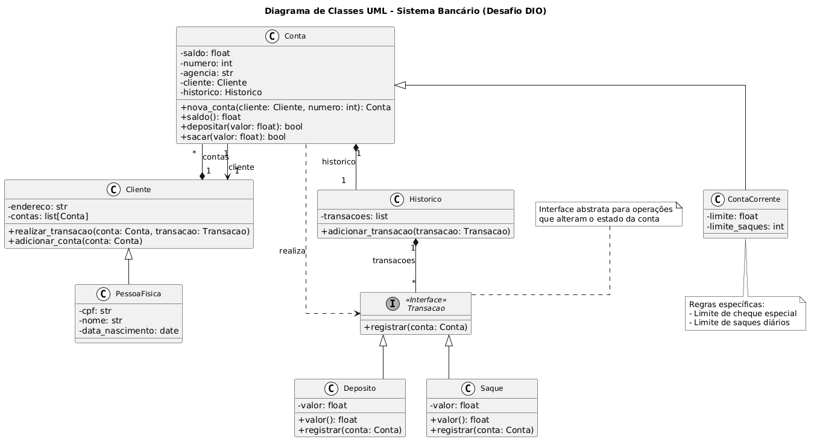
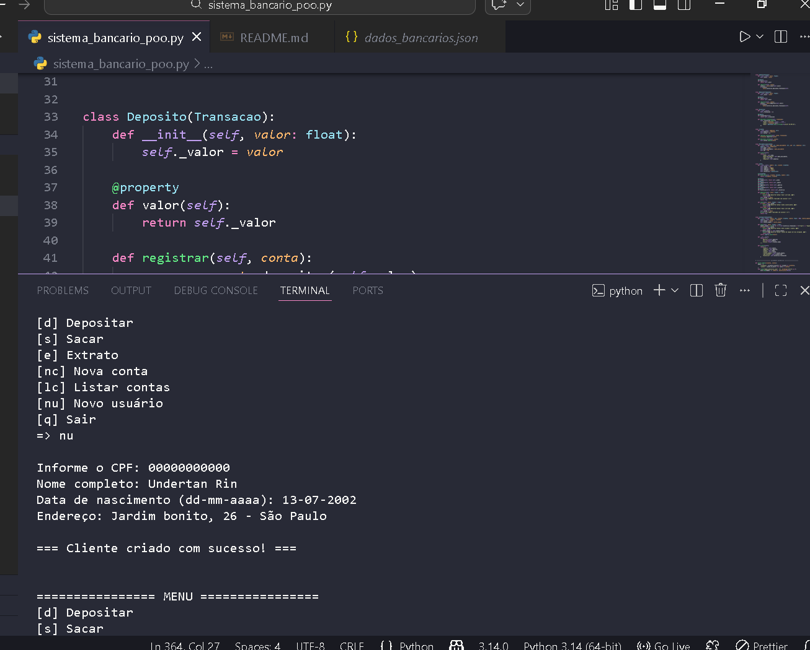
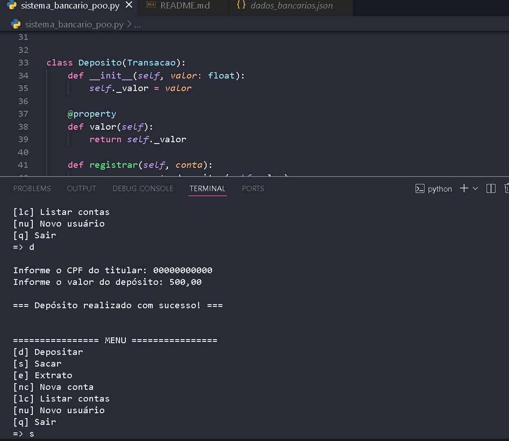
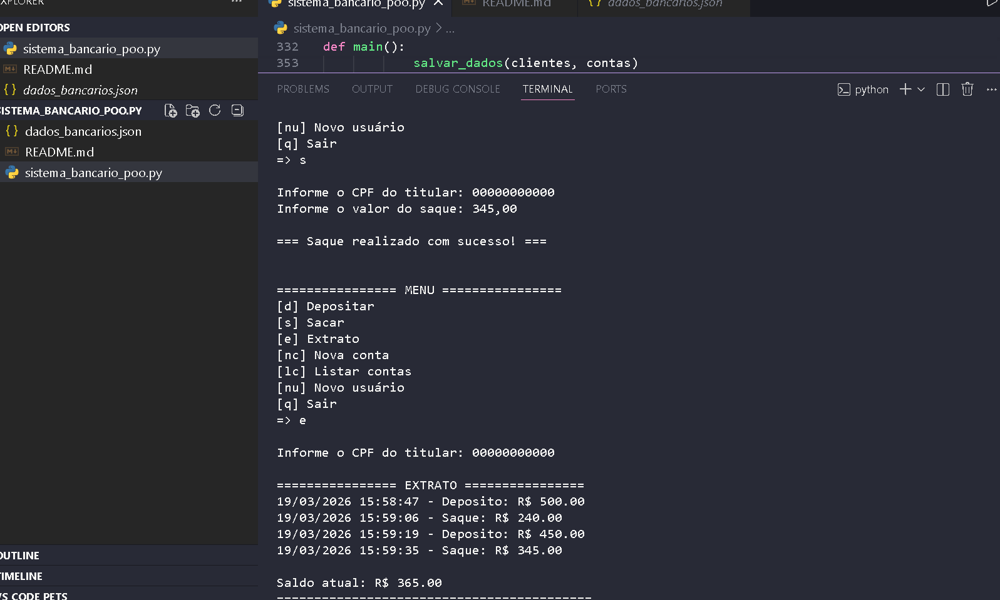

# Sistema Bancário em POO – Desafio DIO

Implementação completa de um sistema bancário utilizando **Programação Orientada a Objetos** em Python, seguindo rigorosamente o diagrama UML fornecido no desafio da trilha Python da Digital Innovation One (DIO).

## Objetivo do Projeto

Transformar a versão procedural (baseada em dicionários e funções) em uma solução orientada a objetos, respeitando as relações, heranças, interfaces e operações definidas no modelo UML.

## Arquitetura e Decisões de Design

- **Linguagem**: Python 3.8+
- **Paradigma**: Programação Orientada a Objetos (POO)
- **Padrões aplicados**:
  - Herança (Cliente → PessoaFisica | Conta → ContaCorrente)
  - Abstração e Interface (classe abstrata `Transacao` com método `registrar()`)
  - Encapsulamento (atributos protegidos com `_` e propriedades `@property`)
  - Factory Method (`Conta.nova_conta()`)
  - Composição (Conta possui `Historico`, Cliente possui lista de `Conta`)
- **Persistência**: Salvamento automático em JSON (`dados_bancarios.json`) após operações mutáveis
- **Tratamento de entrada**: Suporte a valores monetários com vírgula (ex: 275,50) → convertido para float
- **Validações principais**:
  - Saldo insuficiente
  - Limite de saque diário (padrão: 3 saques)
  - Valor negativo ou zero
  - Limite de cheque especial
  - CPF duplicado

### Diagrama de Classes (UML fornecido no desafio)

## Estrutura de Classes Principais

| Classe              | Responsabilidade Principal                          | Herda de          | Atributos/Associações principais                     |
|---------------------|-----------------------------------------------------|-------------------|------------------------------------------------------|
| `Transacao`         | Interface abstrata para operações financeiras       | ABC               | `valor` (property abstrata), `registrar(conta)`      |
| `Deposito` / `Saque`| Implementações concretas de transações              | Transacao         | `valor`                                              |
| `Historico`         | Registro cronológico de transações                  | —                 | Lista de dicionários `{tipo, valor, data}`           |
| `Cliente`           | Entidade base para clientes                         | —                 | `endereco`, `contas: list[Conta]`                    |
| `PessoaFisica`      | Cliente com dados pessoais                          | Cliente           | `nome`, `data_nascimento`, `cpf`                     |
| `Conta`             | Conta bancária genérica                             | —                 | `saldo`, `numero`, `agencia`, `cliente`, `historico` |
| `ContaCorrente`     | Conta com limite e controle de saques               | Conta             | `limite`, `limite_saques`                            |

## Funcionalidades Implementadas (conforme menu)

- `nu` – Novo usuário (criação de `PessoaFisica`)
- `nc` – Nova conta corrente (vinculada ao cliente via CPF)
- `d`  – Depósito (via `Deposito` + `registrar()`)
- `s`  – Saque (via `Saque` + regras de limite)
- `e`  – Extrato (exibição do histórico + saldo atual)
- `lc` – Listar contas (exibição formatada)
- `q`  – Sair (salva dados antes de encerrar)

## Persistência de Dados

- **Formato**: JSON
- **Arquivo**: `dados_bancarios.json`
- **Mecanismo**:
  - `salvar_dados()` chamado após criação, depósito, saque e saída
  - `carregar_dados()` executado no início do programa
  - Serialização customizada via métodos `.to_dict()`
  - Recuperação de estado completo (clientes, contas, saldos e histórico)

## Como Executar

 **Pré-requisitos**
 **Python 3.8 ou superior*

**Clone ou baixe o repositório*
- git clone https://github.com/Undertan/sistema-bancario-poo-dio.git
- cd sistema-bancario-poo-dio   # ← corrigido o nome da pasta (sem "desafio-" na frente)

# Executar
python sistema_bancario_poo.py

**Requisitos Técnicos Atendidos**

 Uso de classes e objetos no lugar de dicionários
 Fidelidade total ao diagrama UML
 Implementação da interface Transacao
 Herança correta (PessoaFisica, ContaCorrente)
 Métodos do UML: realizar_transacao, adicionar_conta, nova_conta, adicionar_transacao, etc.
 Menu interativo atualizado para objetos
 Persistência simples entre execuções   

## Exemplos de Execução

 *Criação de Cliente (opção nu)*

*Operação de Depósito (opção d)*

 *Extrato Completo (opção e)*

 **Próximas Possibilidades de Evolução**

-Suporte a múltiplas contas por cliente com seleção interativa
-Transferência entre contas
-Autenticação com senha/PIN
-Tipo de conta Poupança
-Uso de banco de dados relacional (SQLite)
-Testes unitários (pytest)
-Interface CLI mais rica (rich / textual)

***Projeto entregue como parte do desafio "Modelando o Sistema Bancário em POO com Python" – Trilha Python DIO.***
***Desenvolvido por: Leandro***
***Localização: Parauapebas, PA***
***Data: Março/2026***